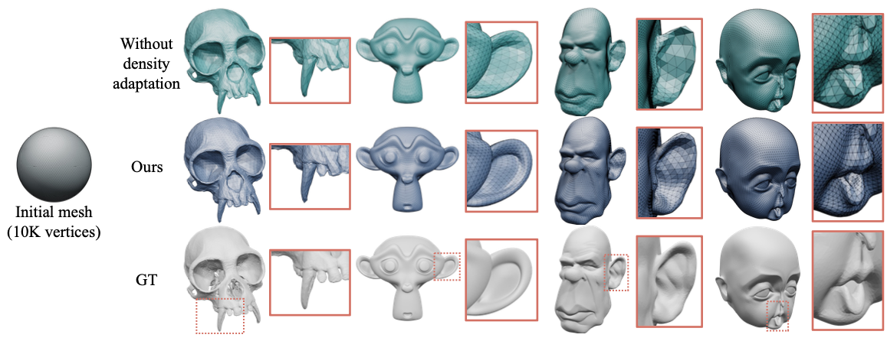

# density-adaptation
\[ArXiv (Will be approved soon)\] \[[Video](https://youtu.be/L-WNBUNyP-Y)\] \[[Paper](https://doi.org/10.1145/3588432.3591498)\]

Official code for Yucheol Jung*, Hyomin Kim*, Gyeongha Hwang, Seung-Hwan Baek, Seungyong Lee,
"Mesh Density Adaptation for Template-based Shape Reconstruction", SIGGRAPH 2023.
(Jung and Kim shares equal contribution)



This repository contains the code for the density adaptation module and scripts for the experiments introduced in the paper.

## Setup

* Clone this repository including the submodules
```bash
git clone --recursive https://github.com/ycjungSubhuman/density-adaptation
```

### Inverse Rendering

* Download the scene files from https://github.com/rgl-epfl/large-steps-pytorch and save the `scene` directory under `ext/large-steps`

#### Docker
* Launch a docker environment using the image `min00001/adadense`
```bash
docker --gpus all -v $PWD:/workspace -it min00001/adadense /bin/bash
cd /workspace
conda activate lapf
python generate_mass.py
```

#### Non-docker

Coming soon


### Non-rigid registration

The code for the non-rigid registration will be released soon.

## Citation

If you want to cite this code, you may refer to this bibtex entry
```bibtex
@inproceedings{jung2023density,
  author = {Jung, Yucheol and Kim, Hyomin and Hwang, Gyeongha and Baek, Seung-Hwan and Lee, Seungyong},
  title = {Mesh Density Adaptation for Template-Based Shape Reconstruction},
  year = {2023},
  isbn = {9798400701597},
  publisher = {Association for Computing Machinery},
  address = {New York, NY, USA},
  url = {https://doi.org/10.1145/3588432.3591498}, doi = {10.1145/3588432.3591498},
  abstract = {In 3D shape reconstruction based on template mesh deformation, a regularization, such as smoothness energy,
  is employed to guide the reconstruction into a desirable direction. In this paper, we highlightan often overlooked property
  in the regularization: the vertex density in the mesh. Without careful control on the density, the reconstruction may suffer
  from under-sampling of vertices near shape details. We propose a novel mesh density adaptation method to resolve the
  under-sampling problem. Our mesh density adaptation energy increases the density of vertices near complex structures via deformation
  to help reconstruction of shape details. We demonstrate the usability and performance of mesh density adaptation with two tasks,
  inverse rendering and non-rigid surface registration. Our method produces more accurate reconstruction results compared to the cases
  without mesh density adaptation. Our code is available at https://github.com/ycjungSubhuman/density-adaptation.},
  booktitle = {ACM SIGGRAPH 2023 Conference Proceedings},
  articleno = {53}, numpages = {10},
  keywords = {diffusion re-parameterization, Laplacian regularization, non-rigid registration, Inverse rendering},
  location = {Los Angeles, CA, USA},
  series = {SIGGRAPH '23}
}
```

## Acknowledgement
This code builds upon https://github.com/rgl-epfl/large-steps-pytorch . We thank the authors for sharing their code.
